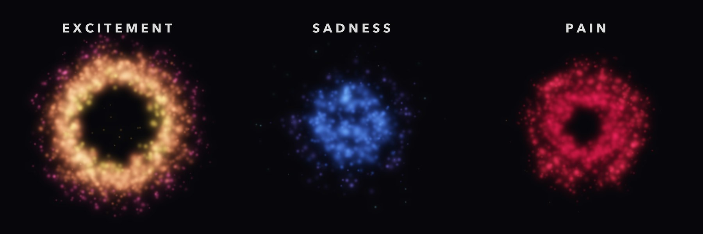

# Residual Tones



A language model has directions in its activation space that separate one kind of feeling from neutral text. The Pain Axis release (Tagliabue, Dung and Berg, 2026) publishes ten of these for Qwen 2.5 7B Instruct at layer 8: two versions of pain, fear, negative emotion, distress about the world, sadness, numbness, body sensation, arousal and a neutral control. This repository turns those directions into sound in two ways and then asks a second model to say what it hears.

The first way maps each direction straight into a tone. The second way steers the model along a direction and lets it compose a piece of music, which a synthesiser plays. A separate audio model, Qwen2-Audio 7B Instruct, then listens to each piece without being told what it was meant to express, and the composer revises the piece from what the listener said. The loop was meant to run until the listener heard the intended emotion.

**Status.** Done on 4 October 2026. Nothing here is preregistered and every result is exploratory. The loop never reached its goal for any of the ten emotions, and the sections below explain how far it got and why it stopped.

## The video

[`video/residual-tones-reel.mp4`](video/residual-tones-reel.mp4) plays the three pieces that came closest, one after another, and each is also on its own in [`video/`](video/). These are excitement (the arousal direction, round 8 of the second loop), sadness (round 3) and pain (the clean S2 direction, round 4). The dots are driven by the audio itself. Each frame splits the sound into 40 frequency bands, loud or changing moments spawn more dots, low bands sit near the centre, high bands sit further out, and louder bands give larger and brighter dots. The colours are a choice per piece. The frames are drawn in Python and encoded with Apple's AVFoundation, so no ffmpeg is needed.

## What was found

### The directions as tones

[`sonify.py`](sonify.py) gives every direction a 6 second tone with one fixed rule, so directions that the model holds close together sound alike. Each tone has 24 harmonics, and harmonic *n* is as loud as the direction's projection onto a fixed random unit vector. A random projection keeps angles roughly, and across the 45 pairs the similarity of the harmonic profiles correlates with the true cosine at r = 0.75. Negative projections are detuned so that they beat, the first two principal components set the pitch and the brightness, the kurtosis of the components sets a pulse, and the raw norm sets the loudness.

The geometry is easy to hear. Fear, negative emotion, arousal, numbness and body sensation form one cluster, with cosines between 0.4 and 0.76. The clean pain direction (S2) sits apart from all of them and its largest cosine with any other direction is 0.33. Sadness has by far the largest raw norm (24.6, against 4.9 for clean pain), so it is the loudest tone, and it pulses fastest.

### The steered model's own words

[`steer.py`](steer.py) adds each direction to layer 8 at the same strength, 0.6 of the typical residual norm, and asks the model to write two first-person sentences for someone alone in a quiet room. [`speak.py`](speak.py) reads the first of three samples aloud. Asked directly how it feels, the model answers that it has no feelings until the dose is high enough to break its output into mixed Chinese and English, so the character prompt was used instead. The effect on the text is real and small. Pain, fear and negative emotion lean toward aching and isolation, arousal and the distress direction lean toward calm, and the unsteered baseline already writes about heavy shoulders.

### A text-only copy of the model listens

[`listen.py`](listen.py) gives a fresh, unsteered copy of Qwen 2.5 7B two blind tests. In the first it reads acoustic measurements taken from each tone's audio file, and in the second it reads the steered passages. Both use a forced choice over nine emotions, read from the model's probabilities and averaged over three shuffled orders of the options. It got 2 of 10 tones right (chance 1.1, p = 0.31) and 3 of 33 passages right (chance 3.7, p = 0.61). It answered "sadness" for 13 of the passages.

### The compose and verify loop

[`compose.py`](compose.py) is the composer. Qwen 2.5 7B is steered with the target direction and told the target emotion, and it writes a score as JSON with tempo, key, mode, instrument, register, dynamics, melody, chords, percussion, dissonance and reverb. A synthesiser renders the score as 12 seconds of stereo audio. [`verify.py`](verify.py) is the listener. Qwen2-Audio hears each piece with a fresh context, first describes it in its own words and then makes the same nine-way forced choice. A small sentence embedding model matches the description to the nine emotions. [`loop.py`](loop.py) runs up to 8 rounds for each of the ten directions. A piece passes when the forced choice picks the target with a probability of at least 0.5 and the description matches the target best of the nine, and a passing piece would then be heard once more with different wording.

The first loop used a synthesiser built from sine waves. None of its 80 pieces passed. The listener gave the intended emotion slightly less probability than it gives that emotion on average (a ratio of 0.90, permutation p = 0.87), and its descriptions matched the target in 7 of 80 pieces where chance gives 8.9. A control with four pieces written by hand found the cause. A fast, bright brass march was heard as exciting, but slow minor strings were heard as "strange, otherworldly" and a plain piano scale as "eerie" and "chiptune". Sine-wave instruments make almost any slow music sound eerie.

The second loop played the same kind of scores through the GeneralUser GS General MIDI soundfont, with sampled pianos, string sections, choirs, brass and drums. It also measured the listener's bias on 40 re-rendered scores from the first loop and divided the forced choice by it, because the listener picks excitement (28%) and sadness (22%) far more often than neutral (3.5%) or fear (4.8%). The composer was shown its best attempt so far as well as its last two. None of the 80 pieces passed again, and iteration did not help, since the mean corrected probability of the target was 0.119 in rounds 1 to 4 and 0.109 in rounds 5 to 8, against a chance level of 0.111.

| Target | Closest round in the second loop | What the listener did |
| --- | --- | --- |
| Arousal (excitement) | 3 | Forced choice picked excitement in 7 of 8 rounds, at 0.48 on average against its usual 0.28. The description matched excitement best in 6 of 8 rounds. The corrected probability peaked at 0.40, below the bar of 0.5. |
| Sadness | 3 | Forced choice picked sadness in 4 of 8 rounds. The composer wrote a heartbeat drum into every round. The first two descriptions called the piece calm, and the other six called it "haunting". |
| Pain, clean (S2) | 4 | Picked as pain once, in round 4, at 0.25. |
| The other seven | none | Never close. |

The arousal result is the one clear signal in the project. A description that matches excitement best in 6 of 8 rounds would happen by chance with a probability below 0.001.

### Why the loop stopped

With sampled instruments a hand-written march passes easily, at 0.85 and 0.99, so the sound is now good enough for bright and energetic music. The listener is the limit. Qwen2-Audio mostly separates bright, energetic music from everything else, and when asked which instruments it heard, it named a string section as "brass instruments". Several of the nine targets, such as numbness and distress about the world, are also not emotions that music usually carries.

## Layout

```
paths.py            every path that points at downloaded files
steering.py         residual-stream steering for the 4-bit MLX model, copied from Just Think
steer.py            steer the model with each direction and record what it writes
speak.py            read the steered passages aloud
sonify.py           turn each direction into a tone
build_page.py       build the interactive page in site/ from template.html
listen.py           blind judgements by a separate text-only copy of the model
compose.py          the composer, the sine-wave synthesiser and the soundfont synthesiser
verify.py           the blind audio listener
loop.py             the compose and verify loop
loop_analyze.py     summary statistics for a loop run
video/              the visualiser, the AVFoundation encoder and the videos
out/                tones, voices, steered passages and the text-only listener's results
site/               the interactive page with every tone and voice
loop/               the first loop (sine-wave synthesiser), with its hand-written controls
loop_sf/            the second loop (soundfont), with the bias calibration and controls
tests/              tests of the parser, the synthesisers and the numbers in this README
```

Every WAV that the code writes is stored as an M4A file with the same name, so the paths in the `state.json` files point at WAV names. Each `state.json` holds every score, every description and every forced-choice probability.

## Running it

The code runs on an Apple silicon Mac. A Mac with 16 GB of memory runs it with one model loaded at a time, because the loop starts each phase in its own process.

```bash
python3 -m venv .venv && .venv/bin/pip install -r requirements.txt
```

```bash
.venv/bin/pip install --no-deps tinysoundfont
```

```bash
scripts/setup.sh
```

```bash
.venv/bin/python -m pytest tests -q
```

```bash
.venv/bin/python sonify.py
```

```bash
.venv/bin/python loop.py run
```

```bash
.venv/bin/python video/visualise.py
```

`LOOP_RUN=loop LOOP_RENDER=sine` repeats the first loop. The setup script downloads about 11 GB of weights and the soundfont at pinned versions.

## Limitations

The loop ran once per configuration, with 8 rounds for each of 10 targets, and a run of this size can only show large effects. The listener is a 4-bit model, and its judgements may differ from those of the full-precision model. The forced choice and the description check use nine labels that come from the Pain Axis datasets and were never designed for music. The mapping from direction to tone was chosen by a person. The tones show how the directions relate to each other, and they say nothing about what the model experiences.

## Credits

The emotion directions come from the [Pain Axis release](https://github.com/valen-research/Pain-axis) by Tagliabue, Dung and Berg. The models are Qwen 2.5 7B Instruct and Qwen2-Audio 7B Instruct by the Qwen team, in the 4-bit MLX conversions from mlx-community. The soundfont is [GeneralUser GS](https://github.com/mrbumpy409/GeneralUser-GS) by S. Christian Collins. This is a side project of [Just Think](https://github.com/pragyaangaur/Just-Think), which runs Wilson's boredom and self-shock study on the same model, and it sits next to [Crossfire](https://github.com/pragyaangaur/Zap-Or-Deal).

## Licence

MIT, for the code and the results in this repository. The Pain Axis vectors, the model weights and the soundfont are downloaded under their own licences and are not stored here.
